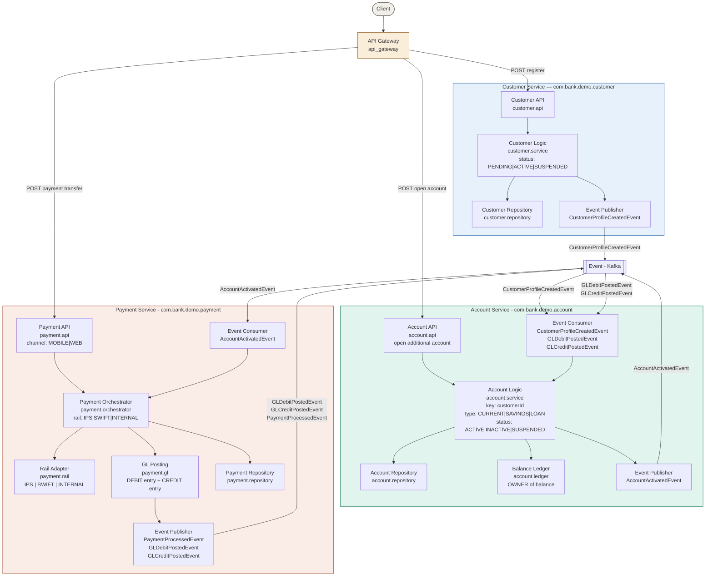
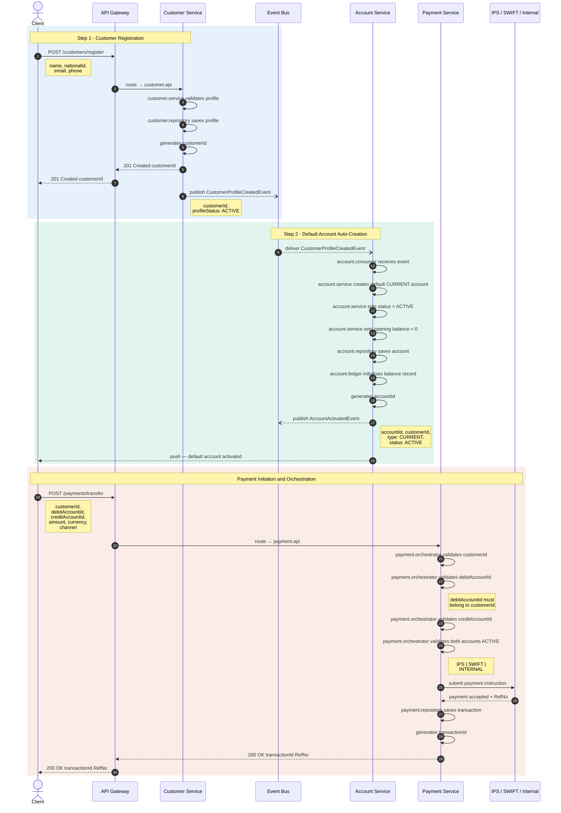

# Banking Microservice

## Architecture Diagram



## Sequence Diagram



## Sequence Diagram-Customer Registration and Payment scenario

```text

DEFINE SYSTEM Banking Platform AS com.bank.demo

DEFINE SERVICE Customer Service AS customer_service
  DEFINE DOMAIN Customer AS customer
    DEFINE COMPONENT Customer API AS api
    DEFINE COMPONENT Customer Business Logic AS service
    DEFINE COMPONENT Customer Repository AS repository
    DEFINE COMPONENT Customer Event Publisher AS events
  CONST CUSTOMER_ID AS customerId
  CONST PROFILE_STATUS AS PENDING | ACTIVE | SUSPENDED

DEFINE SERVICE Account Service AS account_service
  DEFINE DOMAIN Account AS account
    DEFINE COMPONENT Account API AS api
    DEFINE COMPONENT Account Business Logic AS service
    DEFINE COMPONENT Account Repository AS repository
    DEFINE COMPONENT Account Balance Ledger AS ledger
    DEFINE COMPONENT Account Event Publisher AS events
    DEFINE COMPONENT Account Event Consumer AS consumer
  CONST ACCOUNT_KEY AS customerId
  CONST ACCOUNT_TYPE AS CURRENT | SAVINGS | LOAN
  CONST ACCOUNT_STATUS AS ACTIVE | INACTIVE | SUSPENDED
  CONST BALANCE_OWNER AS account_service

DEFINE SERVICE Payment Service AS payment_service
  DEFINE DOMAIN Payment AS payment
    DEFINE COMPONENT Payment API AS api
    DEFINE COMPONENT Payment Orchestrator AS orchestrator
    DEFINE COMPONENT Payment Rail Adapter AS rail
    DEFINE COMPONENT Payment GL Posting AS gl
    DEFINE COMPONENT Payment Repository AS repository
    DEFINE COMPONENT Payment Event Publisher AS events
    DEFINE COMPONENT Payment Event Consumer AS consumer
  CONST DEBIT_ACCOUNT AS debitAccountId
  CONST CREDIT_ACCOUNT AS creditAccountId
  CONST CHANNEL AS MOBILE | WEB | ATM | BRANCH
  CONST RAIL AS IPS | SWIFT | INTERNAL | CARD
  CONST GL_ENTRY AS DEBIT | CREDIT

DEFINE SERVICE API Gateway AS api_gateway
DEFINE SERVICE Event Bus AS event_bus

ASSERT(CLASSES are only CONTAINED within COMPONENTS 
       within DOMAINS within SERVICES)
ASSERT(SERVICES have NO DIRECT DEPENDENCY on other SERVICES)

ASSERT(customer_service publishes 
       CustomerProfileCreatedEvent TO event_bus)
ASSERT(account_service.consumer SUBSCRIBES TO 
       CustomerProfileCreatedEvent FROM event_bus)
ASSERT(account_service.service CREATES default account 
       ON CustomerProfileCreatedEvent WITH status ACTIVE)

ASSERT(account_service.api ACCEPTS additional account 
       requests FROM customerId)
ASSERT(account_service.service VALIDATES customerId 
       EXISTS before opening additional account)
ASSERT(account_service.ledger IS SOLE OWNER of balance)
ASSERT(payment_service has NO DEPENDENCY on 
       account_service.ledger)

ASSERT(payment_service.orchestrator RESOLVES rail 
       AS IPS | SWIFT | INTERNAL | CARD)
ASSERT(payment_service.orchestrator VALIDATES 
       debitAccountId AND creditAccountId via event_bus)
ASSERT(payment_service.gl POSTS GL_ENTRY DEBIT 
       TO event_bus AS GLDebitPostedEvent)
ASSERT(payment_service.gl POSTS GL_ENTRY CREDIT 
       TO event_bus AS GLCreditPostedEvent)

ASSERT(account_service.consumer SUBSCRIBES TO 
       GLDebitPostedEvent FROM event_bus)
ASSERT(account_service.consumer SUBSCRIBES TO 
       GLCreditPostedEvent FROM event_bus)
ASSERT(account_service.ledger UPDATES balance 
       ON GLDebitPostedEvent)
ASSERT(account_service.ledger UPDATES balance 
       ON GLCreditPostedEvent)

ASSERT(payment_service.events PUBLISHES 
       PaymentProcessedEvent TO event_bus)

FOREACH $S IN {customer_service, account_service, 
               payment_service} DO
  ASSERT($S.api has NO DEPENDENCY on $S.repository)
  ASSERT($S.repository has NO DEPENDENCY on other SERVICES)
  ASSERT($S.api is REACHABLE via api_gateway ONLY)
  ASSERT($S.events DEPENDS ON event_bus)
END
```
